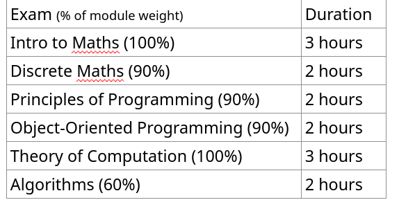
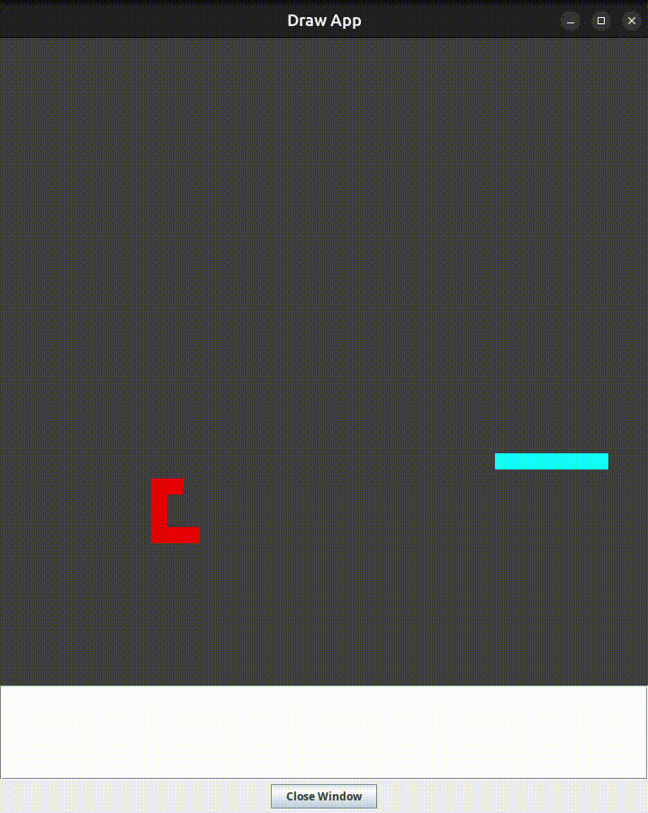

- [Learning and Exam Resources:](#learning-and-exam-resources)
    - [Top Tips](#top-tips)
    - [Resources](#resources)
    - [Help and Support](#help-and-support)
- [Outline of First Year](#outline-of-first-year)
    - [Term Dates](#term-dates)
    - [Term 1](#term-1)
    - [Term 2](#term-2)
    - [Term 3:  Exams](#term-3-exams)
- [Principles of Programming](#principles-of-programming)
    - [C](#c)
    - [Haskell](#haskell)
- [Discrete Mathematics](#discrete-mathematics)
- [Design & Professional Skills](#design-professional-skills)
    - [Python (Term 1)](#python-term-1)
    - [Ethics (Term 2)](#ethics-term-2)
- [Engineering Challenges](#engineering-challenges)
    - [Arduino IDE setup](#arduino-ide-setup)
- [Object-Oriented Programming](#object-oriented-programming)
- [Algorithms](#algorithms)
- [Theory of Computation](#theory-of-computation)
    - [Logic](#logic)
    - [Automata](#automata)
- [Introductory Mathematics](#introductory-mathematics)
- [Contact me:](#contact-me)

# Learning and Exam Resources:

## Top Tips

- The **pin** number for labs is:
    
    - 4673
- UCL **Setup** your laptop help
    
    - [🛠️ Set Up Your Environment | UCL Computer Science Hub 💅](https://uclcshub.github.io/docs/set-up-environment)
- You get a free student .me **doman** from [namecheap.](https://nc.me/) (one year)
    
- [Github Student Developer Pack](https://education.github.com/pack)
    
- **Calculator** allowed is:
    
    - Casio FX83GT+
    - [and others (page 14)](https://www.ucl.ac.uk/academic-manual/sites/academic_manual/files/student_regulations_for_exams_and_assessments_2022-23.pdf "Calculators (approved models only – see below). o Casio FX83GT+ o Casio FX83GTX o Casio FX83MS (battery operated) o Casio FX83ES (battery operated) o Casio FX83WA (battery operated) o Casio FX85GT+ o Casio FX85GTX o Casio FX85MS (solar powered) o Casio FX85ES (solar powered) o Casio FX85WA (solar powered) o Casio FX85GTCW")
    - For Introductory Mathematics. **Not allowed for other modules.**
- Mobile: **Seats Mobile** iOS [Android](https://play.google.com/store/apps/details?id=com.seatssoftware.mobile4)
    
    - Track your attendance (tap in with your ID card)

## Resources

- Moodle
    
- ***https://github.com/sabdullahi18/PT23-24***
    
- *https://drive.google.com/drive/folders/11oPNEwd8IHKzvQAWo1S8DfRxTXZHxae3*
    
- *https://github.com/magetron/UCL-Year1-Exam*
    
- *https://drive.google.com/drive/u/0/mobile/folders/1-Pwmv7gVLp7ZHAhazBWIulHJK5SyiIJb/1-UuotwrRYWNWdCKMuZalRXWGJc37y7QY?usp=drive_link&sort=13&direction=a*
    
- *https://drive.google.com/drive/u/0/mobile/folders/1-Pwmv7gVLp7ZHAhazBWIulHJK5SyiIJb?usp=drive_link*
    
- *Abdul Jabar yt is good for CS help*
    
- *TrevTutor YT*
    
- &nbsp;https://drive.google.com/drive/u/0/mobile/folders/1-Pwmv7gVLp7ZHAhazBWIulHJK5SyiIJb?usp=drive_link
    

## Help and Support

- [Josh Friend](https://www.ucl.ac.uk/students/support-and-wellbeing-services/additional-information/meet-student-support-and-wellbeing-team-14)
- Programming Tutors ☺️

# Outline of First Year

## Term Dates

| Term | Dates |
| --- | --- |
| First term | Monday 23 September 2024 to Friday 13 December 2024 |
| Second term | Monday 13 January 2025 to Friday 28 March 2025 |
| Third term | Monday 28 April 2025 to Friday 13 June 2025 |

**Reading Weeks**

W/O: Monday 4 November 2024

W/O: Monday 17 February 2025

## Term 1

- Principles of Programming
- Discrete Mathematics
- Engineering Challenges
- Design & Professional Skills **Term 1 and Term 2**

## Term 2

- Object-Oriented Programming
- Introductory Mathematics
- Theory of Computation
- Algorithms
- Design & Professional Skills **Term 1 and Term 2**

## Term 3:  Exams



- **Exams held at the [ExCeL London](https://maps.app.goo.gl/3xvuyNSzDbHHyCty8 "https://en.wikipedia.org/wiki/ExCeL_London") Centre**
- **Tip:** try writing your notes for yourself in 6 months (as if you have no pre-understanding)
    - *This helped me relearn what I had forgot*
- **Tip:** It helps to have really good notes before the exam *(maybe during the winter consolidate term 1 or a little bit after the weekend after you learnt a topic)*

# Principles of Programming

- https://github.com/sabdullahi18/PT23-24

## C

- Common pitfalls are:
    - pointers,
    - structures
    - Memory Allocation
- Worksheet questions are helpful for understanding the coursework
- Drawing Program



- Many cool things you can do!

## Haskell

- I think the worksheet questions are a great way of understanding
- Common pitfalls are:
    - Basics of functional programming
    - list comprehension (relate to **Python** and **Math** definition)
    - higher-order functions

# Discrete Mathematics

- [Resources](https://liveuclac-my.sharepoint.com/:f:/g/personal/zcabiga_ucl_ac_uk/EoNXvdLRxZRJpv-zo8f1XnwBmAsukBd0GjXQfbGsoRu5Iw?e=QbUidh)
- The exam is quite easy
- Worksheets are helpful

# Design & Professional Skills

## Python (Term 1)

- Tetris coursework is fun and challenging

## Ethics (Term 2)

- Read the Writing Guidelines thoroughly
    - Marked harshly on paragraph length, first sentence topic, flow of paragraph ect

# Engineering Challenges

- **Teamwork**: It really helps to meet up with your team in-person, and discuss your plans, next steps, problems, delegate tasks ect. (and its fun!)
    
- ### Arduino IDE setup
    
    - [**Arduino Installation for the PC URL**](https://moodle.ucl.ac.uk/mod/url/view.php?id=5762303)
        
        - Installation of software for ENGF0001 2023-24 for Windows. Note, I used windows 11 for this video, but the principles are the same for windows 10. Also note that there's been a new version of the ESP32 software since I made the video - just install the latest (i.e. the suggested) version.
            
            The URLs in the video are:
            
            Arduino: https://www.arduino.cc/
            
            ESP32 boards: https://espressif-docs.readthedocs-hosted.com/projects/arduino-esp32/en/latest/installing.html
            
            &nbsp;
            
    - [**Arduino Installation for the Mac URL**](https://moodle.ucl.ac.uk/mod/url/view.php?id=5765109)
        
        ```
        - Installation of software for ENGF0001 2023-24 for Windows. Note, I used windows 11 for this video, but the principles are the same for windows 10. Also note that there's been a new version of the ESP32 software since I made the video - just install the latest (i.e. the suggested) version.
        - The URLs in the video are:
        - Arduino: https://www.arduino.cc/
        - ESP32 boards: https://espressif-docs.readthedocs-hosted.com/projects/arduino-esp32/en/latest/installing.html
        - Driver: http://www.wch-ic.com/downloads/CH34XSER_MAC_ZIP.html
        - Instructions can be found on: https://github.com/WCHSoftGroup/ch34xser_macos
        ```
        
        - Please remember to **reboot** your laptop after installing the driver.

* * *

# Object-Oriented Programming

&nbsp;

&nbsp;

# Algorithms
[Notes](https://liveuclac-my.sharepoint.com/:f:/r/personal/zcabiga_ucl_ac_uk/Documents/Year%201/Term%202/Algorithms/Notes?csf=1&web=1&e=X8aeGa)

- Expectation to learn content outside of lectures, and do problems in the lectures
- If possible, learn the content every week so that you understand what's going on in the lectures

# Theory of Computation
[Notes](https://liveuclac-my.sharepoint.com/:f:/g/personal/zcabiga_ucl_ac_uk/Ejl37Jn69j5BuW9BoYKgspcBi3y3E8CSdzntqpKC6pZmJA?e=bQPXwR)

## Logic

&nbsp;

## Automata

# Introductory Mathematics
[Notes](https://liveuclac-my.sharepoint.com/:f:/g/personal/zcabiga_ucl_ac_uk/EhSHwCWtUMFClDP8p-ALUZABuj_ASy3ivcuODlmC82OynA?e=XP0XEf)
- Each week is a new topic
- Can assume the exam is around the difficulty of the middle or middle-end of worksheet questions

&nbsp;

**Note:** Please double-check important information (term dates, module weightings, exams ect.) Because I might have made a mistake!

# Contact me

mail@ibrahimgabol.com
